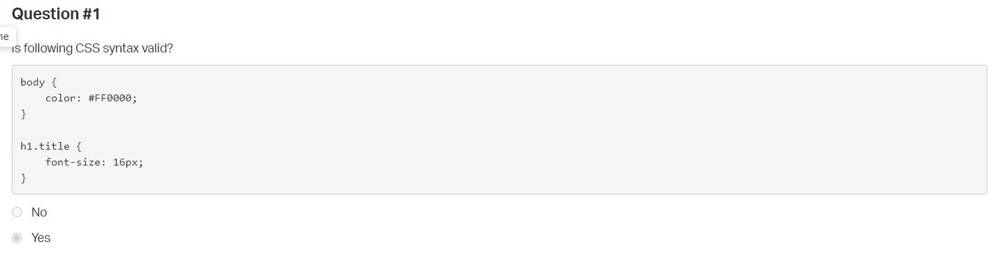

0x01. AirBnB clone - Web static
===============================
`HTML` `CSS` `Front-end`

## Concepts
For this project, we expect you to look at these concepts:
  * [HTML/CSS](https://github.com/sintayehuCSE/Concepts/blob/master/concepts2.md)
  * [The trinity of front-end quality](https://github.com/sintayehuCSE/Concepts/blob/master/concepts4.md)

## Background Context
### Web static, what?
Now that you have a command interpreter for managing your AirBnB objects, it’s time to make them alive!

Before developing a big and complex web application, we will build the front end step-by-step.

The first step is to “design” / “sketch” / “prototype” each element:

Create simple HTML static pages
  * Style guide
  * Fake contents
  * No Javascript
  * No data loaded from anything

During this project, you will learn how to manipulate HTML and CSS languages. HTML is the structure of your page, it should be the first thing to write. CSS is the styling of your page, the design. I really encourage you to fix your HTML part before starting the styling. Indeed, without any structure, you can’t apply any design.

Before starting, please fork or clone the repository `AirBnB_clone` from your partner if you were not the owner of the previous project.

## Resources
**Read or watch:**
  *[ Learn to Code HTML & CSS](https://learn.shayhowe.com/html-css/) (until “Creating Lists” included)
  * [Inline Styles in HTML](https://www.codecademy.com/article/html-inline-styles)
  * [Specifics on CSS Specificity](https://css-tricks.com/specifics-on-css-specificity/)
  * [Introduction to HTML](https://developer.mozilla.org/en-US/docs/Learn/HTML/Introduction_to_HTML)
  * [CSS](https://developer.mozilla.org/en-US/docs/Learn/CSS)
  * [MDN](https://developer.mozilla.org/en-US/)
  * [center boxes](https://css-tricks.com/centering-css-complete-guide/)

## Learning Objectives
At the end of this project, you are expected to be able to [explain to anyone](https://fs.blog/feynman-learning-technique/), without the help of Google:

**General**
  * What is HTML
  * How to create an HTML page
  * What is a markup language
  * What is the DOM
  * What is an element / tag
  * What is an attribute
  * How does the browser load a webpage
  * What is CSS
  * How to add style to an element
  * What is a class
  * What is a selector
  * How to compute CSS Specificity Value
  * What are Box properties in CSS

## Requirements
**General**
  * Allowed editors: `vi`, `vim`, `emacs`
  * All your files should end with a new line
  * A `README.md` file, at the root of the folder of the project, is mandatory
  * Your code should be W3C compliant and validate with [W3C-Validator](https://github.com/alx-tools/W3C-Validator)
  * All your CSS files should be in `styles` folder
  * All your images should be in images folder
  * You are not allowed to use `!important` and `id` (#... in the CSS file)
  * You are not allowed to use tags `img`, `embed` and `iframe`
  * You are not allowed to use Javascript
  * Current screenshots have been done on `Chrome 56` or more.
  * No cross browsers
  * You have to follow all requirements but some `margin`/`padding` are missing - you should try to fit as much as you can to screenshots

  ## More Info
  

## Quiz Questions

## Tasks
## 0. Inline styling
Write an HTML page that displays a header and a footer.

Layout:

  * Body:
    * no margin
    * no padding
  * Header:
    * color #FF0000 (red)
    * height: 70px
    * width: 100%
  * Footer:
    * color #00FF00 (green)
    * height: 60px
    * width: 100%
    * text Best School center vertically and horizontally
    * always at the bottom at the page
**Requirements:**
  * You must use the header and footer tags
  * You are not allowed to import any files
  * You are not allowed to use the style tag in the head tag
  * Use inline styling for all your tags